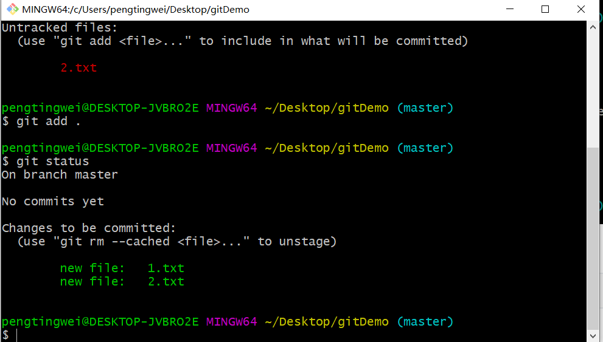

# git 的基本使用

在电脑上面的任何地方点右键  `git Bash Here` 

配置：用户名

```bash
git config --global user.name 用户名
```

配置：邮箱

```bash
git config --global user.email 邮箱
```

查看是否已经配置成功

```bash
git config --list
```

需要将项目文件夹变成被git所管理的工作目录

```bash
git init
```


查看工作目录里面文件的状态

```bash
git status
```


将工作目录的文件放入到暂存区

```bash
git add . // 表示将所有的文件都放入暂存区
git add 文件名 // 一次只能提交一个文件
```



需要将暂存区里面的文件放入到git 仓库

```bash
git commit -m 提交信息
```

注意：需要加上 -m 和提交信息


查看提交的记录

```bash
git log
linux操作  
按空格 下一页  上一页  b   退出 :q  linux命令 
git reflog
```


恢复git仓库中指定版本的项目

```bash
git reset --hard 提交的id
```


> 分支

查看分支

```bash
git branch
```

创建分支

```bash
git branch 分支名称
```

切换分支

```bash
git checkout 需要切换的分支名称
```

一定将这个分支上面所有的文件都必须提交到 git 仓库 再切换其他主分支 

注意：无论在哪个分支都要该分支的文件都被提交到本地仓库，然后再切换

合并分支：

```bash
git merge 哪个分支
```

比如说主分支要合并其它的分支 ，我们一定要在主分支去合并 

## 将本地仓库推送到远程仓库

```bash
git push 远程仓库的地址 分支名称
```


上面的地址太长了，不方便记忆。所以要简化推送的命令 需要给远程仓库的地址取别名

```bash
git remote add 别名 仓库的地址
```

如何查看别名

```bash
git remote -v
```

删除别名

```bash
git remote remove 别名
```

简化推送的命令 -u 表示记住用户名密码和分支名称

```bash
git push -u origin master
```

最终命令推送

```bash
git push
```

克隆仓库

```bash
git clone 仓库的地址
```


拉取远程仓库的代码

```bash
git pull
```


生成密钥

```bash
ssh-keygen
```

